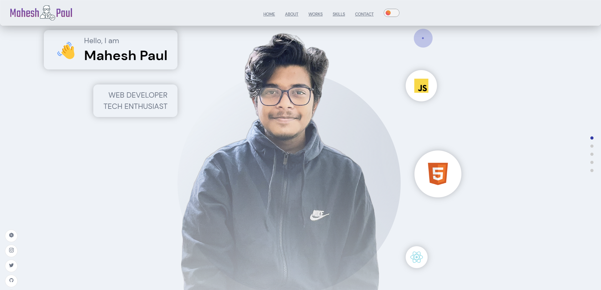

## My Website Portfolio

made using reactJS and Sanity

<h3>Its live <a href="https://maheshpaul.netlify.app/" target="_blank">Here</a></h3>

## Screenshots
Home page

About page

Works page

Skills page

Contact page

It also has Dark mode!!

